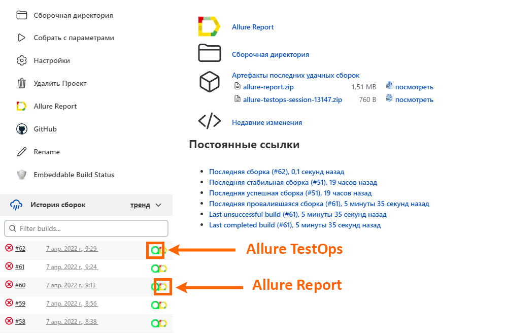

# Дипломный проект по UI тестированию для Gmail
<a target="_blank" href="https://mail.google.com/mail">Gmail</a>

## :pushpin: Содержание:

- [Технологии и инструменты](#технологии-и-инструменты)
- [Тест кейсы](#scroll-Тест-кейсы)
- [Сборка в Jenkins](#jenkins-job)
- [Запуск из терминала](#computer-запуск-тестов-из-терминала)
- [Allure отчет](#отчет-в-allure-report)
- [Интеграция с Allure TestOps](#интеграция-с-allure-testops)
- [Отчет в Telegram](#уведомление-в-telegram-при-помощи-бота)
- [Видео примеры прохождения тестов](#примеры-видео-о-прохождении-тестов)

## :rocket:Технологии и инструменты

<p align="center">
<a href="https://www.jetbrains.com/idea/"></a>
<a href="https://www.java.com/"></a>
<a href="https://github.com/"></a>
<a href="https://junit.org/junit5/"></a>
<a href="https://gradle.org/"></a>
<a href="https://selenide.org/"></a>
<a href="https://aerokube.com/selenoid/"></a>
<a href="https://aerokube.com/selenoid/"></a>
<a href="https://github.com/allure-framework/allure2"></a>
<a href="https://www.jenkins.io/"></a>
<a href="https://www.jenkins.io/"></a>
</p>

## :scroll: Тест кейсы

- ✓ Автотест на соответствие заголовка страницы.
- ✓ Автотест входа в почту.
- ✓ Автотест отправки письма.
- ✓ Автотест лога консоли на наличие ошибок.
- ✓ Ручной тест сохранения в черновики (Добавлен в Allure TestOps).
- ✓ Ручной тест удаления письма (Добавлен в Allure TestOps).

## </a>Jenkins job
### <a target="_blank" href="https://jenkins.autotests.cloud/job/berezkindv_diploma_ui_tests_project/">Сборка в Jenkins</a>

Для запуска сборки нужно нажат кнопку "Собрать с параметрами":
<p align="center">
<a href="https://jenkins.autotests.cloud/job/berezkindv_diploma_ui_tests_project/"></a>
</p>

Далее следует выбрать параметры сборки:
<p align="center">
<a href="https://jenkins.autotests.cloud/job/berezkindv_diploma_ui_tests_project/"></a>
</p>

По завершении сборки можно посмотреть Allure отчет или перейти к Allure TestOps:
<p align="center">
<a href="https://jenkins.autotests.cloud/job/berezkindv_diploma_ui_tests_project/"></a>
</p>


### Параметры сборки в Jenkins:

- browser (браузер, по умолчанию chrome)
- browserVersion (версия браузера, по умолчанию 100.0)
- browserSize (размер окна браузера, по умолчанию 1920x1080)
- browserMobileView (отображение мобильной версии, для примера iPhone X)
- remoteDriverUrl (логин, пароль и адрес удаленного сервера selenoid)
- videoStorage (адрес, по которому можно получить видео)
- threads (количество потоков)

## :computer: Запуск тестов из терминала

Локальный запуск:
```bash
gradle clean test
```

Удаленный запуск:
```bash
clean
${TASK}
-Dbrowser=${BROWSER}
-DbrowserVersion=${BROWSER_VERSION}
-DbrowserSize=${BROWSER_SIZE}
-DbrowserMobileView="${BROWSER_MOBILE}"
-DremoteDriverUrl=https://${LOGIN}:${PASSWORD}@${REMOTE_DRIVER_URL}/wd/hub/
-DvideoStorage=https://${REMOTE_DRIVER_URL}/video/
-Dthreads=${THREADS}
```

## </a>Отчет в <a target="_blank" href="https://jenkins.autotests.cloud/job/berezkindv_performance_lab_complete_project/22/allure/">Allure report</a>

### Основное окно

<p align="center">

</p>

### Тесты

<p align="center">

</p>

### Гафики

<p align="center">

</p>

## </a>Интеграция с <a target="_blank" href="https://allure.autotests.cloud/launch/10223">Allure TestOps</a>

### Дашборд

<p align="center">

</p>

### Тест-кейсы (добавляем ручные тесты)

<p align="center">

</p>

## </a>Уведомление в Telegram при помощи бота
По завершении всех операций телеграм бот отправит отчет со статистикой:
<p align="center">

</p>


### </a>Примеры видео о прохождении тестов

<p align="center">
 
</p>
